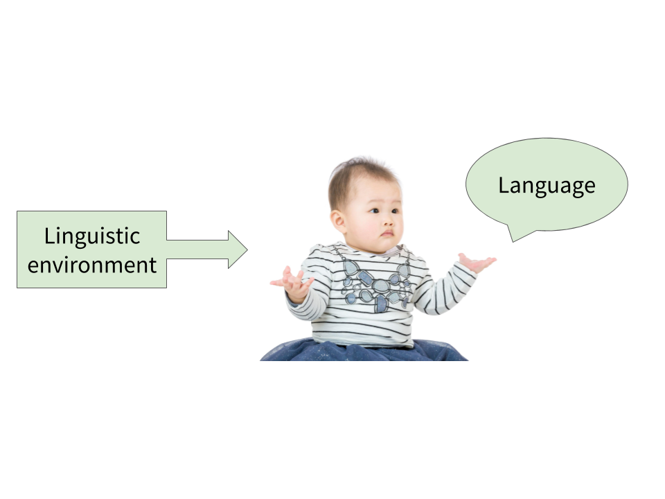
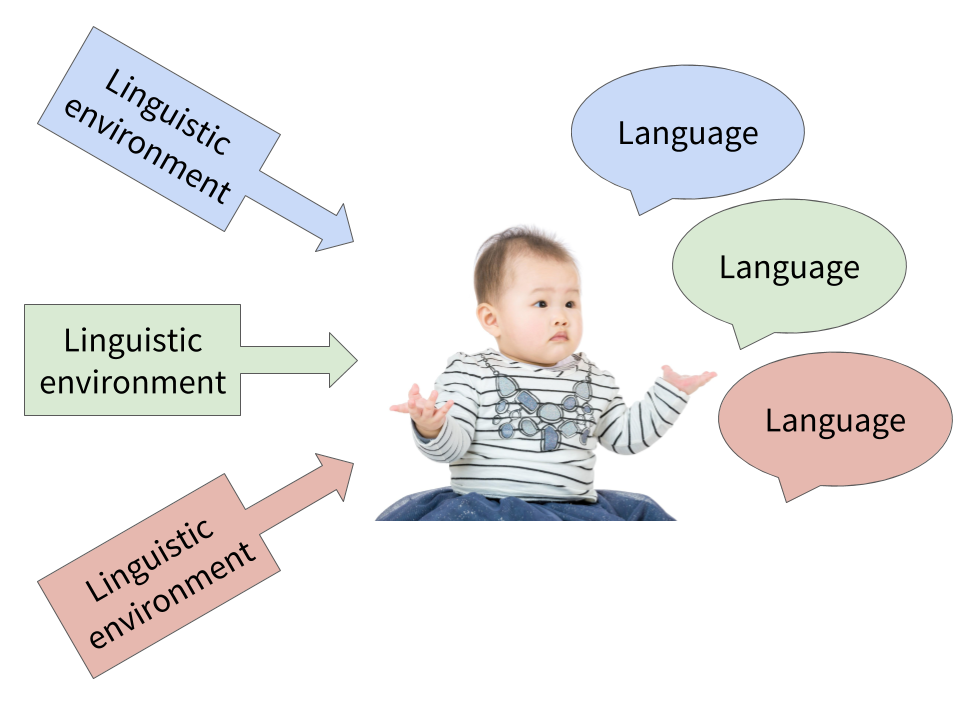
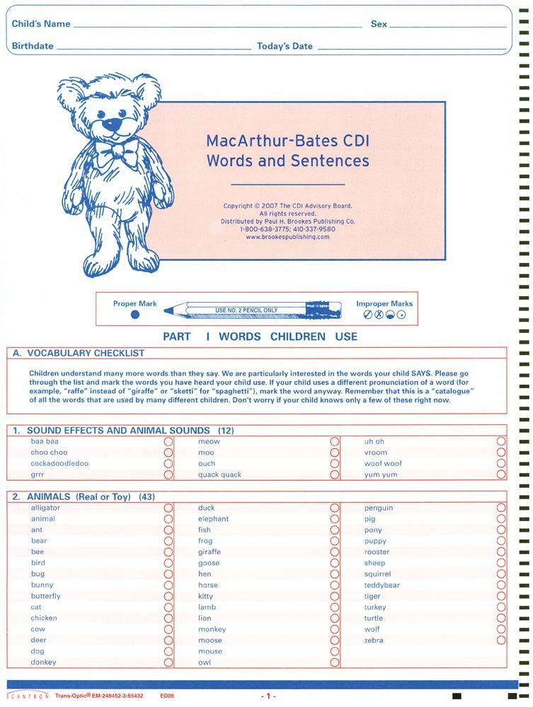

```{r setup, include=FALSE}
library(tidyverse)
library(ggthemes)
library(ggstance)
library(ggrepel)
library(directlabels)
library(langcog)
library(quantregGrowth)
library(feather)
source("predictQR_fixed.R")

knitr::opts_chunk$set(echo = FALSE, cache = TRUE, warning = FALSE,
                      message = FALSE)
options(DT.options = list(searching = FALSE, lengthChange = FALSE))

.font <- "Source Sans Pro"
theme_set(theme_mikabr(base_family = .font))
theme_update(plot.margin = margin(0, 0, 2, 0, "pt"),
             legend.margin = margin(0, 0, 0, 0, "pt"))
.grey <- "grey70"
.refline <- "dotted"

.scale_colour_discrete <- ggthemes::scale_colour_ptol
.scale_color_discrete <- .scale_colour_discrete
.scale_fill_discrete <- ggthemes::scale_fill_ptol

label_caps <- as_labeller(function(value) {
  paste0(toupper(substr(value, 1, 1)), substr(value, 2, nchar(value))) %>%
    str_replace_all("_", " ")
})

dt <- function(data, cnames = label_caps(colnames(data)), ...) {
  DT::datatable(
    data = data,
    rownames = FALSE,
    colnames = cnames,
    ...
  )
}
```

```{r load-data, include=FALSE}
load("data/demo_props.Rds")
# plot_demo_props <- demo_props %>%
#   unnest() %>%
#   mutate(prop = num_true / (num_true + num_false)) %>%
#   split(.$demo)

demo_labels <- list("sex" = "Sex",
                    "birth_order" = "Birth order",
                    "mom_ed" = "Maternal education")

demo_coefs <- read_feather("data/demo_coefs.feather")

demo_coefs_coded <- demo_coefs %>%
  filter(!(term %in% c("(Intercept)", "age")), measure == "produces") %>%
  mutate(estimate = if_else(term %in% c("sexMale", "birth_order1", "birth_order2"),
                            -estimate, estimate),
         ci_lower = estimate - qnorm(.975) * std.error,
         ci_upper = estimate + qnorm(.975) * std.error,
         exp_estimate = exp(estimate),
         exp_ci_lower = exp(ci_lower),
         exp_ci_upper = exp(ci_upper),
         term = term %>%
           fct_recode("Female : Male" = "sexMale",
                      "First : Second" = "birth_order1",
                      "Second : Third+" = "birth_order2",
                      "Secondary : Below Secondary" = "mom_ed1",
                      "College and Above : Secondary" = "mom_ed2",
                      NULL = "mom_edCollege and Above"),
         demo = demo %>%
           fct_recode("Birth order" = "birth_order",
                      "Maternal education" = "mom_ed",
                      "Sex" = "sex")) %>%
  filter(!is.na(term),
         !(language == "English (British)" & demo == "Maternal education"))

terms <- unique(demo_coefs_coded$term)
term_colours <- ptol_pal()(length(terms)) %>% set_names(terms)

demo_ranef <- read_feather("data/demo_ranef.feather")

demo_ranef_coded <- demo_ranef %>%
  gather(term, estimate, -language, -measure, -demo, -definition) %>%
  filter(!is.na(estimate), measure == "produces",
         !(term %in% c("(Intercept)", "age"))) %>%
  mutate(estimate = if_else(term %in% c("sexMale", "birth_order1", "birth_order2"),
                            -estimate, estimate),
         exp_estimate = exp(estimate),
         term = term %>%
           fct_recode("Female : Male" = "sexMale",
                      "First : Second" = "birth_order1",
                      "Second : Third+" = "birth_order2",
                      "Secondary : Below Secondary" = "mom_ed1",
                      "College and Above : Secondary" = "mom_ed2",
                      NULL = "mom_edCollege and Above"),
         demo = demo %>%
           fct_relevel("sex", "birth_order", "mom_ed") %>%
           fct_recode("Birth order" = "birth_order",
                      "Maternal education" = "mom_ed",
                      "Sex" = "sex")) %>%
  filter(!is.na(term),
         !(language == "English (British)" & demo == "Maternal education"))

admins <- read_feather("data/admins.feather")
eng_ws <- admins %>%
  filter(!is.na(sex), language == "English (American)", form == "WS")
ages <- data.frame(age = min(eng_ws$age):max(eng_ws$age))

fit_gcrq <- function(df, quantiles = 0.5) {
  df_gcrq <- gcrq(production ~ ps(age, monotone = 1, lambda = 1000),
                  data = df, tau = quantiles)
  predictQR_fixed(df_gcrq, newdata = ages) %>%
    as.data.frame() %>%
    mutate(age = ages$age) %>%
    gather(quantile, predicted, -age) %>%
    mutate(quantile = if_else(quantile == ".", "0.5", quantile),
           quantile = factor(quantile)) %>%
    as_tibble()
}

eng_fits <- fit_gcrq(eng_ws)

eng_fits_sex <- eng_ws %>%
  group_by(sex) %>%
  nest() %>%
  mutate(fits = map(data, fit_gcrq)) %>%
  select(-data) %>%
  unnest()

show_age <- 24

# sex_props <- demo_props %>%
#   filter(language == "English (American)", measure == "produces",
#          demo == "sex") %>%
#   pull(data) %>%
#   .[[1]] %>%
#   mutate(total = num_true + num_false,
#          prop = num_true / total)
# 
# show_age <- 24
# sex_props %>%
#   filter(unscaled_age == show_age) %>%
#   arrange(desc(prop))
# 
# demo_props
```

## As vocabulary grows... {.flexbox .vcenter}

```{r var, fig.width=6}
s <- 0.3
a <- 0.3
# vs <- seq(0, 600, by = 200)
admin_base <- ggplot(eng_ws, aes(x = age, y = production)) +
  scale_x_continuous(breaks = seq(16, 30, 2), expand = expand_scale(0.01),
                     limits = c(15.5, 30.5)) +
  # scale_y_continuous(breaks = vs, expand = expand_scale(0.01)) +
  scale_y_continuous(expand = expand_scale(0.01),
                     limits = c(min(eng_ws$production), max(eng_ws$production))) +
  labs(x = "Age (months)", y = "Productive vocabulary size")

admin_base
```

<div class="notes">
Over the course of the first few years of their lives, children rapidly learn hundreds of words.
</div>

## As vocabulary grows... {.flexbox .vcenter}

```{r var-line, dependson="var", fig.width=6}
admin_base +
  geom_line(aes(x = age, y = predicted), color = "black", size = 1.5,
            data = eng_fits)
```

<div class="notes">
Over the course of the first few years of their lives, children rapidly learn hundreds of words.
</div>

## ...children vary immensely {.flexbox .vcenter}

<div class="notes">
But around this typical trajectory, there is a tremendous amount of individual variation -- each point here is a child, and they differ greatly in vocabulary size across development. So a central question for the study of language development is -- where does this variation come from? How much is expected and how much is cause for concern or intervention?
</div>

```{r var-point, dependson="var", fig.width=6}
admin_base +
  geom_jitter(colour = "slategrey", size = s, alpha = a) +
  geom_line(aes(x = age, y = predicted), color = "black", size = 1.5,
            data = eng_fits)
```

## with subgroups of variation {.flexbox .vcenter}

<div class="notes">
One way to get a handle on the sources of this variation is to look for subgroups of children that seem to hang together. So we can say that while children have all sorts of vocabulary sizes, girls tend to have substantially larger vocabulary sizes than boys.
</div>

```{r var-sex, dependson="var", fig.width=6}
# show_vocab_sex <- eng_fits_sex %>% filter(age == show_age)

labels <- eng_fits_sex %>%
  filter(age == median(age)) %>%
  rename(production = predicted) %>%
  mutate(age = if_else(production == max(production), age - 2, age + 2),
         production = if_else(production == max(production),
                              production * 1.5, production / 1.5))
admin_base +
  geom_jitter(aes(colour = sex), size = s, alpha = a) +
  geom_line(aes(x = age, y = predicted, color = sex), size = 1.5,
            data = eng_fits_sex) +
  # geom_segment(aes(x = age, xend = age, y = 0, yend = predicted, colour = sex),
  #              linetype = "dashed", data = show_vocab_sex) +
  # geom_segment(aes(x = 15.5, xend = age, y = predicted, yend = predicted,
  #                  colour = sex),
  #              linetype = "dashed", data = show_vocab_sex) +
  geom_text(aes(label = sex, colour = sex), data = labels, family = .font,
            fontface = "bold", size = 6) +
  # scale_y_continuous(breaks = c(vs, round(show_vocab_sex$predicted)),
  #                    expand = expand_scale(0.01)) +
  scale_colour_ptol(guide = FALSE)
```

<!--
---



---


-->

## {.build}

<div class="notes">
Decades of research has used parent report vocabulary checklists -- the CDI -- to quantify language development. A large body of research using this and other methods has revealed that girls tend to know more words than boys, that earlier-born children tend to know more words than later-born children, and that children from higher SES families tend to more words than children from lower-SES families. This last set of findings has received particular attention -- as we've seen from the other presentations in this symposium, it has important real-world consequences for children's lives. Grouped by SES, the quantity and quality of language input that children receive predicts their vocabulary size and other language skills, and vocabulary at only 25 months old predicts cognitive and linguistic abilities at 8 years old.

How do we go beyond a simple breakdown of vocabulary by demographic factor and beyond just a correlation between input and vocabulary? To ask more fine-grained questions, we need more data...

median productive vocabulary at 24 months in english

girls 368.7, boys 272.4 (1.4 times larger) [wordbank]

first 355.3, second 297.6 (1.2 times larger) [wordbank]

higher SES 441.5, lower 287.9 (1.5 times larger) [fernald2013]

lowest SES group less than a third of words of highest SES group
</div>

<div class="columns-2">
<br>


<br>

<div>Vocabulary size</div>

- Girls > boys<br>
  <div class="grey moresmall">Eriksson et al, 2012; Frank et al, 2016</div>
- First-born > later-born<br>
  <div class="grey moresmall">Goldfield & Reznick, 1990</div>
- Higher SES > lower SES<br>
  <div class="grey moresmall">Arriaga et al 1998; Fernald, Marchman, & Weisleder, 2013</div>

<br>

- Quantity/quality of language input → vocabulary size<br>
  <div class="grey moresmall">Hart & Risley, 1995; Hoff, 2003</div>
- Vocabulary at 25 months → abilities at 8 years<br>
  <div class="grey moresmall">Marchman & Fernald, 2008</div>

</div>


##

<div class="notes">
To get more data, we built Wordbank, an open repository that aggregates CDI data. Wordbank now has tens of thousands of administrations of the CDI in dozens of languages. This let's us explore questions in a consistent way across languages.

This let's us explore holistically the question of where do demographic differences reside? Concretely, if girls say more words than boys, *which words* do they say? Is it the case that they simply produce each word more with some probability, or are there individual words that are more likely to be produced? Or are both true?
</div>

<div class="centered">
<br>

</div>


## {.flexbox .vcenter .build}

Do individual words carry demographic signal?

```{r plot-items, fig.width=5.5, fig.asp=0.42}
plot_items <- c("dog", "dress (object)", "tractor")

item_props <- demo_props %>%
  filter(language == "English (American)", measure == "produces",
         demo == "sex") %>%
  pull(data) %>%
  .[[1]] %>%
  filter(definition %in% plot_items) %>%
  mutate(total = num_true + num_false,
         prop = num_true / total,
         definition = str_remove(definition, " \\(.*\\)$"))

overall_props <- item_props %>%
  group_by(unscaled_age, definition) %>%
  summarise(num_true = sum(num_true), total = sum(total), prop = num_true / total)

ggplot(overall_props, aes(x = unscaled_age, y = prop)) +
  facet_wrap(~definition, nrow = 1) +
  coord_fixed(ratio = 22) +
  geom_smooth(aes(weight = total), se = FALSE, size = 0.8, method = "glm",
              method.args = list(family = "binomial"), colour = "darkgrey") +
  labs(x = "Age (months)", y = "Proportion produces") +
  lims(y = c(0, 1))
```

```{r plot-items-sex, fig.width=5.5, fig.asp=0.5}
ggplot(item_props, aes(x = unscaled_age, y = prop, colour = sex)) +
  facet_wrap(~definition, nrow = 1) +
  coord_fixed(ratio = 22) +
  geom_smooth(aes(weight = total), se = FALSE, size = 0.8, method = "glm",
              method.args = list(family = "binomial")) +
  .scale_colour_discrete() +
  labs(x = "Age (months)", y = "Proportion produces",
       colour = "") +
  lims(y = c(0, 1)) +
  theme(legend.position = "top",
        legend.box.margin = margin(b = -10))
```

<div class="notes">
Various words have various learning trajetories...
But different words also have various differences between those trajectories for some demographic variable, e.g.
</div>

```{r sample-size}
sample_sizes <- demo_props %>%
  filter(measure == "produces") %>%
  mutate(demo = demo %>%
           fct_recode("Sex" = "sex",
                      "Birth order" = "birth_order",
                      "Maternal education" = "mom_ed")) %>%
  right_join(demo_coefs_coded %>% distinct(language, demo)) %>%
  mutate(ns = map(data, function(df) {
    df %>%
      mutate(total = num_true + num_false) %>%
             # num_items = n_distinct(definition)) %>%
      distinct(unscaled_age, total, sex, birth_order, mom_ed) %>%
      group_by(sex, birth_order, mom_ed) %>%
      summarise(n = sum(total),
                min_age = min(unscaled_age), max_age = max(unscaled_age)) %>%
      gather(demo, level, -n, -min_age, -max_age) %>%
      filter(!is.na(level)) %>%
      select(-demo)
  })) %>%
  select(-data, -measure) %>%
  unnest() %>%
  mutate(level = level %>% fct_inorder())

demo_levels <- unique(sample_sizes$level)
level_colours <- set_names(ptol_pal()(length(demo_levels)), demo_levels)

sample_size_plot <- function(plot_demo) {
  demo_sizes <- sample_sizes %>%
    filter(demo == plot_demo) %>%
    group_by(language) %>%
    mutate(language_n = sum(n),
           ages = paste(min(min_age), max(max_age), sep = "–")) %>%
    ungroup() %>%
    mutate(language = fct_reorder(language, language_n))
  ggplot(demo_sizes, aes(x = language, y = n, fill = level)) +
    coord_flip() +
    geom_col(position = position_stack(reverse = TRUE)) +
    geom_text(aes(label = ages, y = max(demo_sizes$language_n) * 1.1),
              family = .font, hjust = 1, colour = .grey, size = 4) +
    scale_fill_manual(values = level_colours, name = "") +
    scale_y_continuous(expand = expand_scale(mult = c(0, 0.02))) +
    guides(fill = guide_legend()) +
    labs(x = "", y = "Number of children") +
    theme(legend.position = "top",
          legend.margin = margin(t = 0, r = 0, b = -0.35, l = 0, unit = "cm"),
          legend.justification = c(0, 1),
          legend.title = element_text(face = "bold",
                                      margin = unit(c(0, 0, -0.15, 0), "cm")),
          plot.margin = unit(c(0.3, 0.3, 0.3, -0.3), "cm"))
}
```

## Data {.build .smaller}

Sex<br>
– Assigned __female__ at birth<br>
– Assigned __male__ at birth
  
```{r sample-sex, dependson="sample-size", fig.height=4.5}
sample_size_plot("Sex")
```

<div class="notes">
various subsets of the datasets in Wordbank are coded for one or more demographic variable

exclude a language from a given analysis if it has fewer than 50 children for each level of that demographic variable

number of children is technically number of CDI administrations (includes longitudinal data)

sex is assigned at birth -- not making no claims about whether "sex" effects are related to socialization, genetics, etc. for convenience, saying "female" and "girls" for "assigned female at birth" and "male" and "boys" for "assigned male at birth"
</div>

## Data {.build .smaller}

Birth order<br>
– __First__-born<br>
– __Second__-born<br>
– __Third__-born or later-born

```{r sample-bo, dependson="sample-size", fig.height=4}
sample_size_plot("Birth order")
```

## Data {.build .smaller}

Maternal education<br>
– __Below Secondary__<br>
– __Secondary__ (~high school degree)<br>
– __College and Above__ (~college degree)

```{r sample-momed, dependson="sample-size", fig.height=4}
sample_size_plot("Maternal education")
```

<div class="notes">
maternal education is proxy for SES (studies show high correlation). hard problem of mapping across educational systems...

mapping is hard
</div>

---

```{r model-test}
# load("data/English (American)_produces_mom_ed.Rds")
# mf <- model@frame
# mf %>% select(birth_order, definition) %>% distinct() %>% head()
# unique(mf$birth_order)
# nd <- cross_df(list(birth_order = c("First", "Second", "Third+"),
#                                 age = 0,
#                                 definition = c("brother", "sister")))
#   # mutate(.fitted = predict(model, type = "response", newdata = .))
# augment(model, newdata = nd, type.predict = "response")
# broom.mixed::tidy(model, conf.int = TRUE, effects = "fixed", exponentiate = TRUE) %>%
  # select(term, estimate, conf.low, conf.high)
# demo_coefs_coded %>% filter(language == "English (American)",
#                             measure == "produces",
#                             demo == "Birth order") %>%
#   select(term, estimate, ci_lower, ci_upper)
```

## Analysis {.build}

For a language and demographic:
```
produces ~ age + birth_order + (age + birth_order | item)
```

- fixed effect for each demographic in each language
- random effect for each item for each demographic in each language
- coding scheme gives difference between adjacent levels

<div class="small">
```{r demo-info}
demo_ranef_coded %>%
  group_by(language, demo) %>%
  summarise(num_items = n_distinct(definition),
            levels = paste(unique(term), collapse = "<br>")) %>%
  group_by(demo, levels) %>%
  summarise(languages = n_distinct(language),
            items = paste(range(num_items), collapse = "–")) %>%
  select(demo, languages, items, levels) %>%
  dt(options = list(dom = "t", ordering = FALSE), escape = FALSE,
     class = "cell-border", cnames = c("", "Languages", "Items", "Effects"))
```
</div>

<div class="notes">
separate model for each language and demographic factor

mixed-effects logistic regression

backward difference coding as contrasts

exponentiated slopes, so interpretable as odds ratio
</div>

## Results

```{r coef-plot}
plot_demo_coefs <- function(plot_demo, show_data = TRUE) {
  plot_data <- demo_coefs_coded %>%
    filter(demo == plot_demo) %>%
    arrange(term, abs(estimate)) %>%
    mutate(language = fct_inorder(language))

  # p <- 3
  # plot_breaks <- keep(log(c(rev(1 / 2^(1:p)), 2^(0:p))),
  #                     ~.x > min(plot_data$estimate) &
  #                       .x < max(plot_data$estimate))
  # plot_labels <- round(exp(plot_breaks), 2)
  plot_labels <- c(1, 1.2, 1.4, 1.6, 1.8, 2)
  plot_breaks <- log(plot_labels)
    
  plt <- ggplot(plot_data, aes(x = estimate, y = language, colour = term)) +
    facet_wrap(~term) +
    scale_colour_manual(values = term_colours, guide = FALSE) +
    geom_vline(xintercept = 0, colour = .grey, linetype = .refline) +
    expand_limits(x = 0) +
    labs(x = "Odds ratio", y = "", title = plot_demo) +
    # theme(legend.position = "top", legend.direction = "vertical",
    #       legend.margin = margin(t = 0, r = 0, b = -0.35, l = 0, unit = "cm"),
    #       legend.justification = c(0, 1),
    #       legend.title = element_text(face = "bold",
    #                                   margin = unit(c(0, 0, -0.15, 0), "cm")),
    #       plot.margin = unit(c(0.3, 0.3, 0.3, -0.3), "cm"),
    #       panel.grid.major.y = element_line(colour = "grey92", size = 0.2))
    theme(panel.grid.major.y = element_line(colour = "grey92", size = 0.2),
          plot.title = element_text(face = "bold"))
  if (show_data) plt <- plt +
    geom_pointrangeh(aes(xmin = ci_lower, xmax = ci_upper), fatten = 3,
                     position = position_dodgev(height = 0.2)) +
    scale_x_continuous(breaks = plot_breaks, labels = plot_labels)
  else plt <- plt +
    geom_pointrangeh(aes(xmin = ci_lower, xmax = ci_upper), fatten = 3,
                     position = position_dodgev(height = 0.2), alpha = 0) +
    scale_x_continuous(breaks = 0, labels = 1)
    # guides(colour = guide_legend(override.aes = list(alpha = 1)))
  return(plt)
}
```

```{r coef-sex-prep, dependson="coef-plot", fig.height=5}
plot_demo_coefs("Sex", show_data = FALSE)
```

## Results

```{r coef-sex, dependson="coef-plot", fig.height=5}
plot_demo_coefs("Sex")
```

<div class="notes">
95% confidence intervals

equally likely would be 1, so languages' effects are significant and girl-advantaged
</div>

## Results

```{r coef-bo-prep, dependson="coef-plot"}
plot_demo_coefs("Birth order", show_data = FALSE)
```

## Results

```{r coef-bo, dependson="coef-plot"}
plot_demo_coefs("Birth order")
```

<div class="notes">
all languages favor earlier birth order, first over second and second over later

relative size of one to the other varies a lot
</div>

## Results

```{r coef-momed-prep, dependson="coef-plot"}
plot_demo_coefs("Maternal education", show_data = FALSE)
```

## Results

```{r coef-momed, dependson="coef-plot"}
plot_demo_coefs("Maternal education")
```

<div class="notes">
all languages favor more maternal education

interpretation of variation tricky in light of hard mapping problem
</div>

```{r ranef-plot}
num_extremes <- 5

plot_demo_ranef_lang <- function(plot_language, plot_measure, plot_demo,
                                 binwidth = 0.03, label = TRUE) {
  
  demo_data <- demo_ranef_coded %>%
    filter(language == plot_language, measure == plot_measure,
           demo == plot_demo) %>%
    mutate(#panel = paste(demo, term, sep = "\n"),
           definition = str_remove(definition, " \\(.*\\)$"))
  
  demo_labelled <- bind_rows(
    demo_data %>% group_by(language, term) %>% top_n(num_extremes, estimate),
    demo_data %>% group_by(language, term) %>% top_n(num_extremes, -estimate)
  )
  
  dotsize <- 0.7
  stackratio <- 1.5

  p <- 3
  plot_breaks <- keep(log(c(rev(1 / 2^(1:p)), 2^(0:p))),
                      ~.x > min(demo_data$estimate) &
                        .x < max(demo_data$estimate))
  plot_labels <- exp(plot_breaks)

  plt <- ggplot(demo_data, aes(x = estimate)) +
    facet_wrap(~term) +
    geom_vline(xintercept = 0, colour = .grey, alpha = 0.6) +
    geom_dotplot(aes(colour = term, fill = term), method = "histodot",
                 alpha = 0.6, binwidth = binwidth, dotsize = dotsize,
                 stackratio = stackratio) +
    scale_x_continuous(breaks = plot_breaks, labels = plot_labels) +
    scale_colour_manual(values = term_colours, guide = FALSE) +
    scale_fill_manual(values = term_colours, guide = FALSE) +
    labs(x = "Odds ratio (random effect)", y = "Number of of words",
         title = plot_demo) +
    theme_mikabr(base_size = 12) +
    theme(strip.text = element_text(#margin = margin(b = 0.2, unit = "cm"),
                                    size = rel(1)),
          # panel.spacing.y = unit(0.5, "cm"),
          plot.title = element_text(face = "bold"))
  
  if (label) plt <- plt +
    geom_label_repel(aes(label = definition, y = 0), colour = "slategrey",
                     data = demo_labelled,
                     segment.size = 0.3,
                     label.padding = 0.15,
                     point.padding = unit(0.15, "lines"),
                     arrow = arrow(length = unit(0.01, "npc")),
                     nudge_y = 0.2,
                     force = 2,
                     family = .font, size = 4, fill = "white")

  gb <- ggplot_build(plt)
  max_count <- max(gb$data[[2]]$count)
  step <- 20
  labels <- c(1, seq(step, max_count, by = step))

  ratio <- max_count * binwidth * dotsize * stackratio
  plt +
    coord_fixed(ratio = ratio) +
    scale_y_continuous(labels = labels,
                       limits = c(0, 1),
                       breaks = seq(0, max(labels) / max_count,
                                    length.out = length(labels)),
                       expand = c(0.01, 0, 0.04, 0))
}
```

```{r tops}
items <- read_feather("data/items.feather")

categories <- items %>%
  select(language, category, definition) %>%
  distinct() %>%
  group_by(language, definition) %>%
  summarise(category = paste(category, collapse = ", "))

top <- 5
tops <- demo_ranef_coded %>%
  left_join(categories) %>%
  select(language, demo, category, definition, term, estimate) %>%
  mutate(neg_estimate = -estimate) %>%
  rename(positive = estimate, negative = neg_estimate) %>%
  gather(direction, estimate, positive, negative) %>%
  group_by(language, demo, term, direction) %>%
  top_n(top, estimate) %>%
  arrange(desc(estimate)) %>%
  mutate(rank = 1:n(),
         definition = str_remove(definition, " \\(.*\\)$"))

# tops %>% ungroup() %>% filter(demo == "Maternal education", direction == "negative") %>%
#   count(category) %>% arrange(desc(n))

plot_tops <- function(dem, dir, title, nc, s1, s2,
                      cat_select = unique(tops$category), cat_label = " ") {
  fg <- tops %>% filter(demo == dem, direction == dir, category %in% cat_select)
  bg <- tops %>% filter(demo == dem, direction == dir, !(category %in% cat_select))
  ggplot(NULL, aes(x = term, y = rank, label = definition)) +
    facet_wrap(~language, ncol = nc) +
    # coord_fixed(ratio = 0.5) +
    geom_label(aes(colour = language), fontface = "bold", size = s1,
               label.padding = unit(0.15, "lines"), family = "Gulim",
               data = fg) +
    geom_label(colour = .grey, size = s1, label.padding = unit(0.15, "lines"),
               family = "Gulim", data = bg) +
    # geom_label(aes(colour = language), fontface = "bold", label.size = 0.5,
    #            data = tops %>% filter(demo == dem, direction == dir)) +
    # geom_label(colour = "grey", alpha = 0.5, data = bg) +
    labs(title = title, caption = cat_label) +
    scale_colour_solarized(guide = FALSE) +
    ylim(0.2, top + 0.2) +
    # scale_x_discrete(expand = expand_scale(add = xex)) +
    theme(axis.line.y = element_blank(),
          axis.text.x = element_blank(),
          axis.text.y = element_blank(),
          axis.ticks = element_blank(),
          axis.title.x = element_blank(),
          axis.title.y = element_blank(),
          panel.background = element_blank(),
          panel.border = element_blank(),
          panel.grid.major = element_blank(),
          panel.grid.minor = element_blank(),
          plot.background = element_blank(),
          panel.spacing = unit(0, "lines"),
          strip.text = element_text(size = s2, margin = margin(b = 2)),
          plot.title = element_text(face = "bold", size = s2 + 2),
          plot.caption = element_text(size = 14))
}
```

## Item results {.flexbox .vcenter}

```{r ranef-sex, dependson="ranef-plot"}
plot_demo_ranef_lang("English (American)", "produces", "Sex", label = FALSE)
```

## Item results {.flexbox .vcenter}

```{r ranef-sex-lab, dependson="ranef-plot"}
plot_demo_ranef_lang("English (American)", "produces", "Sex")
```

<div class="notes">
showing just american english, random effect for each word, distribution with 4 most outlying words labelled

gender-associated toys and clothing, genitals
</div>

## Item results {.flexbox .vcenter}

```{r tops-sex-pos, dependson="tops", fig.width=8, fig.height=5}
plot_tops("Sex", "positive", "Female > Male", 7, 2.5, 8)
```

## Item results {.flexbox .vcenter}

```{r tops-sex-pos-cat, dependson="tops", fig.width=8, fig.height=5}
plot_tops("Sex", "positive", "Female > Male", 7, 2.5, 8, "clothing", "Clothing")
```

## Item results {.flexbox .vcenter}

```{r tops-sex-neg, dependson="tops", fig.width=8, fig.height=5}
plot_tops("Sex", "negative", "Male > Female", 7, 2.5, 8)
```

## Item results {.flexbox .vcenter}

```{r tops-sex-neg-cat, dependson="tops", fig.width=8, fig.height=5}
plot_tops("Sex", "negative", "Male > Female", 7, 2.5, 8, "vehicles", "Vehicles")
```

## Item results {.flexbox .vcenter}

```{r ranef-bo, dependson="ranef-plot"}
plot_demo_ranef_lang("English (American)", "produces", "Birth order", 0.02,
                     label = FALSE)
```

## Item results {.flexbox .vcenter}

```{r ranef-bo-lab, dependson="ranef-plot"}
plot_demo_ranef_lang("English (American)", "produces", "Birth order", 0.02)
```

<div class="notes">
colors and animals most earlier-biased

sibling, sweets, "hate" most later-biased
</div>

## Item results {.flexbox .vcenter}

```{r tops-bo-pos, dependson="tops", fig.width=8, fig.height=3.5}
plot_tops("Birth order", "positive", "First > Second & Second > Third+", 4,
          3.1, 12)
```

## Item results {.flexbox .vcenter}

```{r tops-bo-pos-cat, dependson="tops", fig.width=8, fig.height=3.5}
plot_tops("Birth order", "positive", "First > Second & Second > Third+", 4,
          3.1, 12, "descriptive_words", "Descriptive Words")
```

## Item results {.flexbox .vcenter}

```{r tops-bo-neg, dependson="tops", fig.width=8, fig.height=3.5}
plot_tops("Birth order", "negative", "Second > First & Third+ > Second", 4,
          3.1, 12)
```

## Item results {.flexbox .vcenter}

```{r tops-bo-neg-cat, dependson="tops", fig.width=8, fig.height=3.5}
plot_tops("Birth order", "negative", "Second > First & Third+ > Second", 4,
          3.1, 12, "people", "People")
```

## Item results {.flexbox .vcenter}

```{r ranef-momed, dependson="ranef-plot"}
plot_demo_ranef_lang("English (American)", "produces", "Maternal education",
                     label = FALSE)
```

## Item results {.flexbox .vcenter}

```{r ranef-momed-lab, dependson="ranef-plot"}
plot_demo_ranef_lang("English (American)", "produces", "Maternal education")
```

<div class="notes">
animals most higher education biased, also babysitter's name

sweets more lower education biased, also "walker" (elderly relatives?)

possible confound between birth order and SES if lower-SES families tend to have more later-born children
</div>

## Item results {.flexbox .vcenter}

```{r tops-momed-pos, dependson="tops", fig.width=8, fig.height=3.5}
plot_tops("Maternal education", "positive",
          "College and Above > Secondary & Seconday > Below Seconday", 3,
          3.4, 12)
```

## Item results {.flexbox .vcenter}

```{r tops-momed-pos-cat, dependson="tops", fig.width=8, fig.height=3.5}
plot_tops("Maternal education", "positive",
          "College and Above > Secondary & Seconday > Below Seconday", 3,
          3.4, 12, "animals", "Animals")
```

## Item results {.flexbox .vcenter}

```{r tops-momed-neg, dependson="tops", fig.width=8, fig.height=3.5}
plot_tops("Maternal education", "negative",
          "Secondary > College and Above & Below Seconday > Seconday", 3,
          3.4, 12)
```

## Item results {.flexbox .vcenter}

```{r tops-momed-neg-cat, dependson="tops", fig.width=8, fig.height=3.5}
plot_tops("Maternal education", "negative",
          "Secondary > College and Above & Below Seconday > Seconday", 3,
          3.4, 12, "food_drink", "Food & Drink")
```


## Takeaways {.build}

<div class="notes">
girls vs boys: gendered clothes and toys, genitals
earlier-born: colors
later-born: siblings/people
higher-SES: animals
lower-SES: certain foods/drinks
</div>

- Across languages, demographic factors have consistent direction but variable magnitude
- Individual words are learned differentially by sex, birth order, maternal education
- Avoid bias in test design by excluding demographically-linked items
- Demographic differences in vocabulary size are influenced by specific content differences

<hr>

<div class="centered small">
Part of larger work on variability and consistency in language learning:<br>
[langcog.github.io/wordbank-book](https://langcog.github.io/wordbank-book/)

All data and code available at: 
[github.com/mikabr/item-demo](https://github.com/mikabr/item-demo)


</div>

<!--
---

__Sex__

```{r tables}
tab_thres <- log(1.5)

demo_table <- function(table_demo) {
  demo_ranef_coded %>%
    filter(demo == table_demo) %>%
    group_by(language, definition) %>%
    filter(any(abs(estimate) > tab_thres)) %>%
    ungroup() %>%
    select(language, item = definition, term, ratio = exp_estimate) %>%
    mutate(ratio = signif(ratio, 2)) %>%
    spread(term, ratio) %>%
    dt()
}
```

```{r tab-sex, dependson="tables"}
demo_table("Sex")
```

<div class="notes">
filtered to words that are 1.5 times more likely one way or the other

오빠 = older brother (female speaker)

vestido = dress

언니 = older sister (female speaker)

kjole = dress

Totós (elásticos de cabelo) = scrunchies

strømpebukser = tights

Gancho = ?

kjole = dress

Pipi = ?

Saia = skirt


형 = older brother (male speaker)

Pilinha/Pila/Pilau = ?
小ㄐㄐ/小鳥(生殖器) = [genitals]

고추 = ? (pepper?)

brrr (bil-lyd) = vroom vroom

Helicóptero = helicopter

formula = ?

</div>

## Results {.smaller}

__Birth order__

```{r tab-bo, dependson="tables"}
demo_table("Birth order")
```

<div class="notes">
earlier-biased: mostly colors, some animals

nougatti = nougat

skole = school

godteri = candy

tyggegummi = gum

bror = brother

søster = sister

hermana = sister

書包 = schoolbag
</div>


## Results {.smaller}

__Maternal education__

```{r tab-momed, dependson="tables"}
demo_table("Maternal education")
```

<div class="notes">
earlier-biased: animals!

later-biased: gum, candy, soda, etc
</div>
-->
